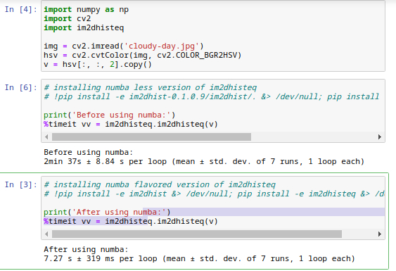

# Comparing a numba-less version and numba-flavored version of the same code base
I recently added [im2dhisteq](https://github.com/Mamdasn/im2dhisteq) to my repository and because it was very slow, I searched for a new way to make my code run faster, as I was already using numpy built-in functions and there were no (at least easy) other way to optimize the code using just numpy.  
I recently found out about numba, which is advertised to run my codes 1000 times faster, but as I later found out the degree of that is actually very dependant on your code.
After reading through their website and through a long series of trials and erros I learned how to write a code that is numba-friendly and is satisfyingly faster than my base code.  
In my repository, in addition to the numba-flavord versions, I released the numba-less versions, which are accessible here: [im2dhisteq](https://github.com/Mamdasn/im2dhisteq/releases) and [imhist](https://github.com/Mamdasn/im2dhist/releases). You can check them out and compare them to come to a base understanding of how numba-friendly codes looks like.  

## Reproducing the results
This is just a showcase, but if you want to check its authenticity, firstly you need to download and extract both versions of numba-less and numba-flavord and follow instructions.  
Firstly, run this command in a terminal `pip install -e im2dhist-0.1.0.9/. &> /dev/null; pip install -e im2dhisteq-0.0.2/. &> /dev/null` to install the numba-less version. After running the bellow code, enter this command in a terminal to install the numba-flavored version: `pip install -e im2dhist &> /dev/null; pip install -e im2dhisteq &> /dev/null` and run the bellow code again.  

```python
import numpy as np
import cv2
import im2dhisteq

img = cv2.imread('cloudy-day.jpg')
hsv = cv2.cvtColor(img, cv2.COLOR_BGR2HSV)
v = hsv[:, :, 2].copy()

print('Before using numba:')
%timeit vv = im2dhisteq.im2dhisteq(v)
```

## Results

